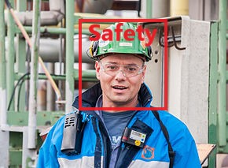

## Project Proposal 
Problem Statement: 
The problem is to ensure the safety of the workers at the construction site. Their safety is ensured by  wearing a proper safety gear to protect their head which in this case a safety helmet.  
## Proposed Solution: 
The proposed solution is that we develop and deploy a machine learning model which ensures and  detects that the if the worker is wearing the proper safety gear, here helmet. We are going to build, train and deploy the model using amazon sage maker. Once the model is developed, and safe to use, it  will be deployed to AWS deep lens enabled camera which detects that if the person is wearing the  safety hat. 
## Technical Aspects: 
We will use AWS DeepLens and Amazon Rekognition to build an application that helps identify if a  person at a construction site is wearing the right safety gear, in this case, a hard hat. We are going to  use custom object detection model machine learning model to tune our parameters as per our  convenience. We will learn to use the face detection model available on AWS DeepLens to detect a face  and upload it to S3 for further processing. We will write a Lambda function that gets triggered on an S3  upload and integrates with Amazon Rekognition to detect if the person is not wearing a helmet. 
Why this apporoach works : 
It will help enhance safety of workplace for the workers with the help of an intelligent security system.  
## Potential Future Developments :  
We can train and use custom object detection model to include more safety measures like gloves, and  safety jackets. 

Sample Detection Output :

